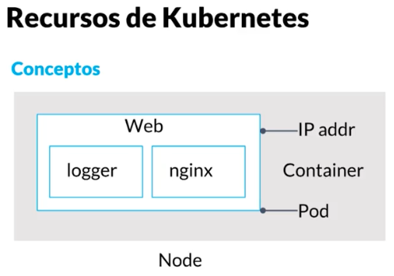
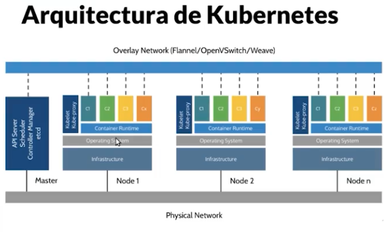

# Orquestacion de contenedores

# Kubernetes

## **Introducción a Kubernetes**

***Conceptos clave de contenedores:***

CGroups: Asignan a cada contenedor/proceso los recursos que va a utilizar (memoria, disco, cpu). Limitan el uso de recursos del sistema operativo para cada contenedor.

Chroot: Nos permite que nuestro proceso/container tenga visibilidad sobre archivos donde tiene que trabajar y no acceder a otros recursos del sistema.

Namespaces: (son 7, aqui los mas importantes):

Mount: Nos permite que nuestro proceso tenga una visibilidad reducida de los directorios. Esto permite que dos contenedores que trabajen sobre un sistema de archivos no se interfieran entre si.

Networking: Permite que cada contenedor tenga su dirección IP, su tabla de rutas, su interfaz de red, y que no interfiera con otros contenedores.

Concepto de POD: Entidad atomica scheduleable - Entidad sobre la cual kubernetes va a ejecutar los contenedores. (se verá en detalle más adelante).

PID o de proceso: si ejecutamos un ps cuando ejecutamos nuestro contenedor, vamos a ver que nuestro contenedor es el process id 1 y no vemos todo el resto de los procesos del SO. Esto es posible gracias al namespace de procesos. (se verá en detalle más adelante).

Link introduccion didactica: https://www.cncf.io/phippy/the-childrens-illustrated-guide-to-kubernetes/

 

  

***Docker y Kubernetes***
* Docker se encarga principalmente de gestionar los contenedores
* Kubernetes es una evolución de los proyectos de Google Borg y Omega
* Todos los cloud providers ofrecen servicios de managed k8s utilizando docker como su container run time

***Kubernetes en la práctica***
* Permite correr varias replicas y asegura que todas se encuentren en funcionamiento
* Provee un balanceador de carga automaticamente
* Define diferentes mecanismos para hacer roll-outs de código
* Politicas de scalling automaticas
* Jobs batch

 

***Arquitectura de Kubernetes***

Nodo Master

API Server: A lo que todo se conecta los agentes, el CLI, el dashboard etc. Cuando se cae un nodo master es lo que se pierde. Se usa el algoritmo de ruft para algoritmo de elección.

Scheduler: Cuando se deben crear un job, un pod en máquinas específicas, el scheduler se encarga de asignar las tareas y administrar los flujos de trabajos, revisando siempre las restricciones y los recursos disponibles.

Controller Manager: Es un proceso que está en un ciclo de reconciliación constante buscando llegar al estado deseado con base al modelo declarativo con el que se le dan instrucciones a K8s.

* Tipos de controller manager:
  
Reply manager

Deployment manager

Service manager

Etcd: Key value store que permite que el cluster este altamente disponible.

* Componentes muy importantes que viven en los nodos:

Kubelet: Agente de kubernetes, se conecta con el control play y le pregunta que recursos (pods, contenedores) debo correr al scheduler via API Server. Monitorea los pods constantemente para saber si están vivos, los recursos disponibles etc y le comunica constantemente al scheduler via API Server.

Kube-proxy: Se encarga de balancear el tráfico que corre en nuestros contenedores/servicios. Una vez llega una request se encarga de decidir a que pod y contenedor debe de ir.

Nodos == Minions

Todos los nodos y masters están conectados a una red física para poder hablarsen entre sí.

